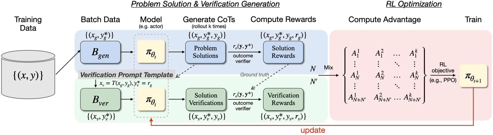

<div align="center">

# _RISE_

<div>
 <b><i>Reinforcing Reasoning with Self-Verification</i></b>
</div>
<div>
🔥 An online RL framework that simultaneously trains LLMs in problem-solving and self-verification with verifiable reward signals. 🔥
</div>
</div>

<br>




## 🗒️ News
- **June 12, 2025**: We update the RISE source code to support the latest verl release [**v0.4.0**](https://github.com/volcengine/verl/releases/tag/v0.4.0).
- **May 20, 2025**: We release our technical report on [**arXiv**](https://arxiv.org/abs/2505.13445) and the initial version of training code based on [**verl**](https://github.com/volcengine/verl).


## 🎯Quick Start

#### Environment Preparation

```shell
git clone --recurse-submodules https://github.com/xyliu-cs/RISE.git && cd RISE

conda create -y -n rise python=3.12.2 && conda activate rise
pip3 install ray[default]
pip3 install torch==2.5.1 torchvision==0.20.1 torchaudio==2.5.1 --index-url https://download.pytorch.org/whl/cu124
pip3 install flash-attn==2.7.4.post1 --no-build-isolation
pip3 install omegaconf==2.4.0.dev3 hydra-core==1.4.0.dev1 antlr4-python3-runtime==4.11.0 vllm==0.7.3
pip3 install math-verify[antlr4_11_0]==0.7.0 fire deepspeed tensorboardX prettytable datasets
cd verl
pip3 install -e .
```
#### Training

* Data Preparation

  ```shell
  OUTPUT_DATA_DIR=/path/to/your/data/output
  # Input data path is coded in generate_splits.py
  python3 verl_utils/data/generate_splits.py --local_dir $OUTPUT_DATA_DIR
  ```

* Start Ray

  ```shell
  # Head node (×1)
  ray start  --head --port=6379  --node-ip-address=$HEAD_ADDR --num-gpus=8
  
  # Worker nodes (xN)
  # Use this only if you are running across multiple machines
  ray start  --address=$HEAD_ADDR:6379 --node-ip-address=$WORKER_ADDR --num-gpus=8
  ```

* Launch training at head node. See `scripts/train` for the complete training scripts.
  ```shell
  # Example
  sh scripts/train/start_qwen3b_rise_example.sh
  ```
  ‼️ **Key Parameters for RISE in the Training Script**

  - `+trainer.online_critique`: Enables (`True`) or disables (`False`) online verification during the RL training.
  - `+data.critique_batch_size`: Controls the number of verification samples included in each training batch.
  - `reward_model.reward_func_path`: Relative path (from `working_dir`) to the Python file defining the **generation reward** function. The file should contain a function named "reward_func".
  - `reward_model.ver_reward_func_path`: Path to the **verification reward** function file. This file should contain a function named "ver_reward_func". Default is `null`, and the generation reward function is used instead.


## 🙏 Acknowledgements

This work can not be done without the help of the following works:

- **[verl](https://github.com/volcengine/verl)**: A very fast reinforcement learning framework.
- **[vllm](https://github.com/vllm-project/vllm)**: A high-throughput and memory-efficient inference and serving engine for LLMs.
- **[OpenMathInstruct-2](https://github.com/NVIDIA/NeMo-Skills)**: Model training and evaluation code.
- **[SimpleRL](https://github.com/hkust-nlp/simpleRL-reason)**: RL training recipes for LLM reasoning.


## 📚 Citation
```bibtex
@article{liu2025trustverifyselfverificationapproach,
      title={Trust, But Verify: A Self-Verification Approach to Reinforcement Learning with Verifiable Rewards}, 
      author={Xiaoyuan Liu and Tian Liang and Zhiwei He and Jiahao Xu and Wenxuan Wang and Pinjia He and Zhaopeng Tu and Haitao Mi and Dong Yu},
      year={2025},
      eprint={2505.13445},
      archivePrefix={arXiv},
      primaryClass={cs.AI},
      url={https://arxiv.org/abs/2505.13445}, 
}
```
